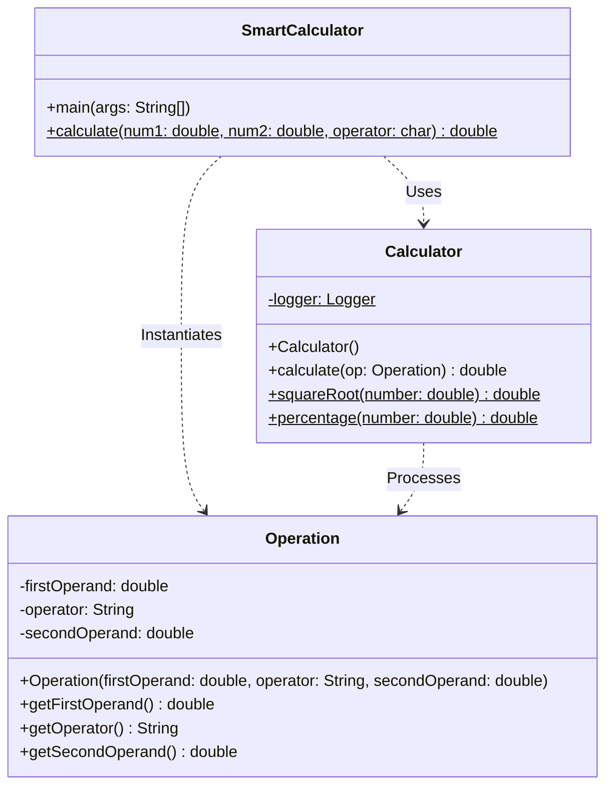

# Developer Notes: SmartCalculator

These developer notes provide details on the Object-Oriented refactoring, the Log4j logging system, and compliance with the WORM principle.

---

## 1. Project Architecture (Phase 4 Refactoring)

To improve maintainability, separation of concerns, and reuse, the single-class implementation has been refactored into a modular 3-class structure:



### Class Responsibilities:
*   **[SmartCalculator](file:///d:/SMART-CALCULATOR/src/main/java/com/savoira/SmartCalculator.java)**: Coordinates interaction. Handles the console reading loop (`Scanner`), parsing input values, handling input errors, instantiating `Operation`, and outputting results. It also holds a deprecated compatibility method to avoid breaking older test suites.
*   **[Operation](file:///d:/SMART-CALCULATOR/src/main/java/com/savoira/Operation.java)**: Represents the model/data capsule. It holds private immutable fields representing the first operand, the operator, and the second operand.
*   **[Calculator](file:///d:/SMART-CALCULATOR/src/main/java/com/savoira/Calculator.java)**: Houses the logical execution engine. Evaluates the operator switch expression and handles division-by-zero guards, returning `Double.NaN` upon calculation failure. It also exposes static mathematical utilities (`squareRoot` and `percentage`).

---

## 2. WORM Compliance & Code Hygiene

The reviewer's recommendation to follow **WORM** (Write Once, Reuse Many / Read Many) is achieved through several design practices:
1.  **Immutability:** Fields in `Operation` are declared as `private final`. Once constructed, the operation's state cannot change, avoiding side effects.
2.  **Centralization of Switch Logic:** The evaluation of math operations resides in a single method `Calculator.calculate(Operation)`. Any updates or support for new operators only need to be written once in `Calculator`, and all parts of the application immediately reuse that logic.
3.  **Naming Conventions:** All classes follow PascalCase (e.g., `SmartCalculator`, `Operation`, `Calculator`). Methods and variables utilize camelCase (e.g., `firstOperand`, `secondOperand`, `calculate`). Single-letter variable names have been eliminated (e.g., `sc` -> `scanner`, `num1` -> `firstNumber`, `num2` -> `secondNumber`, `e` -> `exception`).
4.  **Javadoc Coverage:** All public classes and methods are fully annotated with descriptive Javadoc blocks including `@param` and `@return` tags.

---

## 3. Log4j 2 Logging Integration

The application integrates Apache Log4j 2 for operational and developer-facing logs.

### Configuration
Logging is configured via [log4j2.xml](file:///d:/SMART-CALCULATOR/src/main/resources/log4j2.xml) under `src/main/resources/`.
*   **Log Output Location:** Logs are appended to `logs/calculator.log`.
*   **Root Log Level:** `INFO`.
*   **Console Separation:** Logs are routed exclusively to the file appender. This ensures that developers can review detailed logs and error traces in `logs/calculator.log` without cluttering the console interactive CLI layout.

### Logged Events
1.  **Application Lifecycle:** Info logs when the program starts and terminates cleanly.
2.  **Calculation Execution:** Info logs recording operations (e.g., `Executing calculation: 10.0 + 5.0`).
3.  **Errors & Edge Cases:** Warnings log division by zero or negative square root attempts. Errors log invalid operator attempts.
4.  **Input Parsing Failures:** Warn logs capture when a user enters non-numeric text.

---

## 4. Commands to Build, Test, and Run

### Compilation
```bash
mvn clean compile
```

### Running Tests
```bash
mvn test
```

### Execution (CLI Loop)
```bash
mvn exec:java
```
